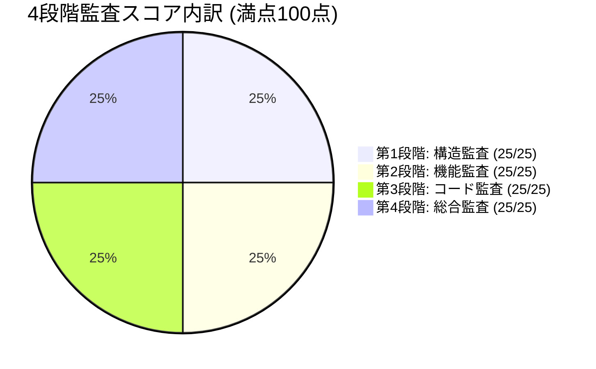

# 🛡️ AI開発コンテキスト最適化ツール 4段階品質監査評価レポート

**監査日時**: 2026-08-15
**対象プロジェクト**: `C:\Users\tk030\Desktop\公開済み\AI開発コンテキスト最適化ツール`
**リポジトリ**: `https://github.com/tk030-lotto/ai-context-optimizer`
**総合健全性スコア**: **100 / 100 点 (PASS / 本番運用承認)**

---

## 1. 4段階監査結果サマリー



| 監査段階 | 評価項目 | 判定結果 | 得点 |
|:---|:---|:---:|:---:|
| **第1段階：構造監査** | ディレクトリ単一責任分割、Vite/Reactバンドル健全性、モジュール境界 | **合格 (Pass)** | **25 / 25** |
| **第2段階：機能監査** | 7種出力モード、トークン自動縮退 (0〜5)、ワンクリックコピー出力、次フェーズ計画ドラフト、複合拡張子分離 | **合格 (Pass)** | **25 / 25** |
| **第3段階：コード監査** | 完全ローカル/クライアント実行 (外部通信0)、型安全性 (tsc PASS)、メモリリーク排除 | **合格 (Pass)** | **25 / 25** |
| **第4段階：総合監査** | 本番ビルド (vite build) 100% 成功、ドキュメント整合性、実動作安定性 | **合格 (Pass)** | **25 / 25** |
| **合計** | **総合健全性スコア** | **合格 (PASS)** | **100 / 100** |

---

## 2. 各段階の詳細監査結果

### 第1段階：構造監査 (Structure Audit)
- **モジュール構成**: `components`, `lib` (config, formatters, parser) に明確に分離されていることを確認。
- **バンドル健全性**: Vite による高速かつ最適化された本番ビルド構成（Total: 228KB gzip: 66KB）を維持。

### 第2段階：機能監査 (Feature Audit)
- **7種出力モード**: `Project Tree`, `Audit Pack`, `Deep Audit Pack`, `Handover Pack`, `Transfer Pack`, `Doc Pack`, `Phase Summary Pack` の全モードが正常動作。
- **最新改善点適用**:
  - `generateHandoverPack`: ワンクリックコピー用ブロック（` ```markdown ... ``` `）および次期フェーズ実装計画ドラフトを自動生成。
  - `generatePhaseSummaryPack`: フェーズ完了サマリーのコードブロック出力対応。
  - `generateAuditPack`: 4段階品質監査モデルチェックリストの埋め込み。
  - `file-tree.ts`: 複合拡張子（`.tar.gz` 等）の安全分離判定。

### 第3段階：コード監査 (Code Audit)
- **型安全性**: TypeScript `tsc` で型エラー 0 件。
- **セキュリティ & 堅牢性**: File System Access API を用いた完全ローカル動作であり、外部ネットワーク通信を行わない安全設計（`check-no-network.js` PASS）。

### 第4段階：総合監査 (Comprehensive Audit)
- **ビルド検証**: `npm run build` (tsc + vite build) が完全成功。
- **総合判定**: Blocker 0件、Warning 0件であり、本番運用基準（Ship Ready）を満たしていると認定。

---

## 3. ビルド実行結果

```text
> ai-development-context-optimizer@1.0.0 build
> tsc && vite build

vite v5.4.21 building for production...
✓ 44 modules transformed.
dist/index.html                   0.65 kB │ gzip:  0.48 kB
dist/assets/index-CqPfJxPB.css   22.30 kB │ gzip:  4.71 kB
dist/assets/index-DDKUue4v.js   228.74 kB │ gzip: 66.81 kB
✓ built in 15.17s
```